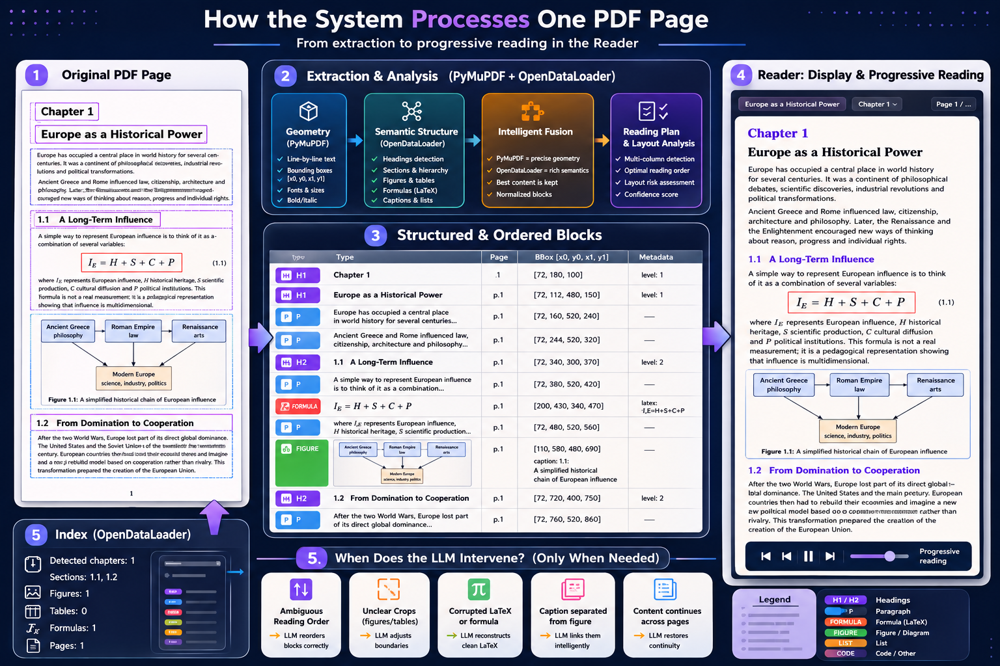
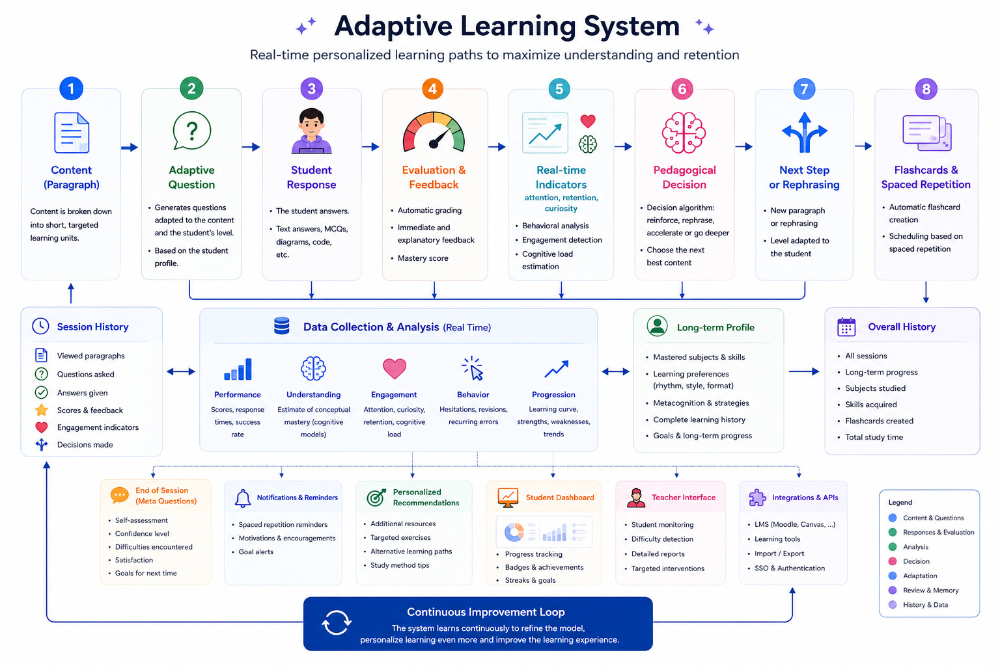
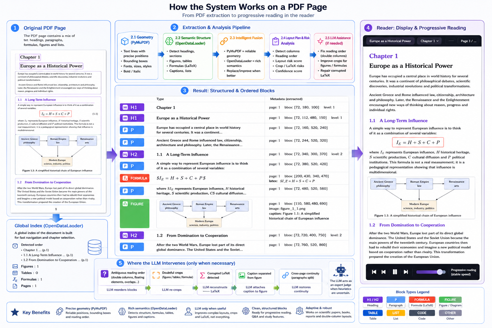

# Meta-Capp
## AI-Native Cognitive Learning System for Complex Educational Documents

> Meta-Capp transforms static educational PDFs into interactive, geometry-aware, metacognitive learning experiences powered entirely by local AI.

---

# The Core Idea

Large Language Models have made information access almost effortless.

But effortless access is not learning.

Modern AI tools often encourage:
- passive consumption,
- instant answers,
- intellectual dependency,
- shallow understanding,
- and the illusion of competence.

Meta-Capp was built from the opposite philosophy.

Instead of replacing effort, it uses AI to **structure effort intelligently**.

Instead of optimizing for “fast answers”, it optimizes for:
- comprehension,
- reflection,
- retention,
- curiosity,
- and metacognitive awareness.

The goal is not to make the learner passive.

The goal is to help the learner build a stronger mind.

---

# What Meta-Capp Is

Meta-Capp is an AI-native educational operating system that reconstructs educational documents into adaptive cognitive learning environments.

It combines:

- geometry-aware PDF parsing,
- semantic reconstruction with Gemma 4,
- cognitive pacing,
- adaptive questioning,
- flashcard generation,
- reflective learning loops,
- and local-first AI inference.

The system does not treat PDFs as raw text.

It reconstructs:
- document structure,
- reading flow,
- semantic hierarchy,
- mathematical content,
- visual relationships,
- and learning intent.

---

# Why This Project Exists

Educational PDFs are cognitively dead interfaces.

Traditional readers display pages.
Traditional OCR extracts characters.
Traditional RAG pipelines chunk text.

None of them truly understand educational documents.

And none of them understand learners.

Meta-Capp exists because learning is not:
- retrieving text,
- generating summaries,
- or asking a chatbot for answers.

Learning is an active cognitive process involving:
- attention,
- memory,
- uncertainty,
- reflection,
- confusion,
- reconstruction,
- and effort.

Meta-Capp was designed to restore these mechanisms in the age of AI.

---

# A Different Philosophy of AI

Most AI educational systems try to remove friction.

Meta-Capp introduces **productive friction**.

The system intentionally encourages:
- recall before assistance,
- reflection before correction,
- reconstruction before explanation,
- and active engagement before passive consumption.

Its educational design is inspired by:
- metacognition research,
- cognitive psychology,
- retrieval practice,
- spacing effects,
- active recall,
- attention management,
- and confidence calibration.

AI is not used to replace thinking.

AI is used to improve thinking.

---

# Why Local AI Matters

Meta-Capp runs entirely locally using Gemma 4 through Ollama.

No subscriptions.
No cloud dependency.
No educational surveillance.
No data harvesting.

Educational data stays on the learner’s machine.

This matters because learning is deeply personal:
- mistakes,
- doubts,
- weaknesses,
- confusion,
- curiosity,
- reflection.

These should not become cloud products.

Local inference also enables:
- offline learning,
- low latency,
- customizable educational behavior,
- long-term ownership,
- and transparent systems.

---

# What Makes Meta-Capp Different

Meta-Capp is NOT:
- a chatbot wrapper,
- a PDF summarizer,
- a generic RAG pipeline,
- or an “ask AI anything” interface.

It is a cognitive learning system.

The AI does not merely answer questions.

It:
- reconstructs documents,
- understands layouts,
- analyzes learning behavior,
- identifies misconceptions,
- creates adaptive learning loops,
- and models the learner’s cognitive state.

---

# Core Features

| Capability | Description |
|---|---|
| **AI-Native PDF Reconstruction** | Geometry-aware reconstruction of educational documents |
| **Double-Column Understanding** | Correct scientific-paper reading order recovery |
| **Mathematical Content Preservation** | LaTeX-aware extraction and reconstruction |
| **Figure & Diagram Intelligence** | Caption association and crop validation |
| **Interactive Cognitive Reader** | Progressive rendering to reduce cognitive overload |
| **Adaptive Quiz Generation** | Contextual open-ended and MCQ generation |
| **Flashcard Engine** | Automatic active-recall card generation |
| **Metacognitive Reflection** | Confidence and strategy-oriented questioning |
| **Misconception Detection** | AI analysis of reasoning patterns |
| **Cognitive Profile Tracking** | Multi-axis learner evolution |
| **Dynamic Subject Gauges** | Automatic subject profiling from imported documents |
| **Fully Local AI** | Gemma 4 via Ollama, no cloud inference |

---

# Screenshots

## PDF Reconstruction Engine

From raw PDF geometry to a structured, semantically ordered, reader-ready document — in one pipeline.

The diagram below shows how PyMuPDF geometry, OpenDataLoader structure analysis, and Gemma 4 semantic reasoning combine at each stage.



---

## Adaptive Learning System

After each reading session, the metacognitive engine builds a real-time learner profile across comprehension, retention, attention, curiosity, and creativity — and adapts the next session accordingly.



---

# System Architecture

```txt
                ┌────────────────────┐
                │ Educational PDF    │
                └─────────┬──────────┘
                          │
              ┌───────────▼───────────┐
              │ Geometry Extraction   │
              │ (PyMuPDF)             │
              └───────────┬───────────┘
                          │
              ┌───────────▼───────────┐
              │ Document Intelligence │
              │ (Gemma 4 + Layout AI) │
              └───────────┬───────────┘
                          │
         ┌────────────────┼────────────────┐
         │                │                │
         ▼                ▼                ▼
  Interactive       Quiz Engine     Flashcards
     Reader                             
         │
         ▼
  Metacognitive Engine
         │
         ▼
  Cognitive Profile Update
```

---

# Document Intelligence Layer

This is the technical heart of Meta-Capp.

The system combines:
- symbolic geometry extraction,
- semantic reasoning,
- and educational restructuring.

The LLM does NOT operate on raw OCR text.

Instead, Gemma 4 receives:
- geometry-aware blocks,
- spatial metadata,
- layout information,
- reading-order candidates,
- and semantic context.

This allows the system to understand documents structurally rather than statistically.

---

# PDF Reconstruction Pipeline

```txt
PDF File
    │
    ▼
PyMuPDF Geometry Extraction
(bounding boxes, fonts, coordinates)
    │
    ▼
Layout Reconstruction
(column detection, block classification)
    │
    ▼
Math Zone Detection
(formula boundary preservation)
    │
    ▼
Reading-Order Reconstruction
(heuristic + Gemma validation)
    │
    ▼
Post-Processing Pipeline
(paragraph rebuilding, LaTeX repair,
figure normalization)
    │
    ▼
Gemma 4 Semantic Correction
(document intelligence layer)
    │
    ▼
Interactive Cognitive Reader
```



---

# Why Meta-Capp Is Not Traditional RAG

Traditional RAG systems:
- chunk raw text,
- ignore geometry,
- lose figures,
- break equations,
- flatten hierarchy,
- and have no educational model.

Meta-Capp instead:
- reconstructs document semantics,
- preserves layout logic,
- understands educational structure,
- integrates metacognition,
- and models learner cognition.

This is not retrieval augmentation.

It is cognitive reconstruction.

---

# The Role of Gemma 4

Gemma 4 is central to the system.

It is used as:
- a document intelligence engine,
- an educational generation engine,
- and a metacognitive reasoning engine.

Not simply as a chatbot.

---

## Document Understanding

Gemma 4 performs:
- reading-order correction,
- semantic grouping,
- figure-caption verification,
- layout interpretation,
- mathematical reconstruction,
- and educational chunk validation.

---

## Educational Generation

Gemma 4 generates:
- quizzes,
- flashcards,
- explanations,
- summaries,
- curiosity prompts,
- and adaptive review suggestions.

---

## Metacognitive Analysis

Gemma 4 analyzes:
- confidence,
- reflection quality,
- misconception patterns,
- learning strategies,
- and retention indicators.

The system therefore models not only *what the learner answered*, but *how the learner thinks*.

---

# Metacognitive Learning Loop

Most educational systems optimize for correctness.

Meta-Capp optimizes for learning quality.

```txt
Read
  │
  ▼
Answer
  │
  ▼
Reflect
  │
  ▼
Analyze misconceptions
  │
  ▼
Generate adaptive review
  │
  ▼
Update cognitive profile
  │
  ▼
Strengthen long-term retention
```


The objective is to improve:
- understanding,
- memory,
- attention,
- and self-awareness.

Not simply produce correct outputs.

---

# Cognitive Profile System

The learner profile evolves across five dimensions:

| Axis | Description |
|---|---|
| **Comprehension** | Depth of understanding |
| **Retention** | Long-term memory consolidation |
| **Attention** | Focus stability during learning |
| **Curiosity** | Exploratory engagement |
| **Creativity** | Ability to form conceptual connections |

Subject-specific gauges are created automatically by the AI when new learning domains emerge.

---

# Interactive Cognitive Reader

The reader is designed around cognitive pacing principles.

Instead of overwhelming the learner with a static page, Meta-Capp progressively renders educational content.

This:
- reduces overload,
- improves attentional stability,
- encourages active processing,
- and slows passive scrolling behavior.

The reader therefore becomes part of the learning methodology itself.

---

# Installation

## Requirements

- Python 3.10+
- Ollama
- Gemma 4 running locally

---

## Install Ollama

[Ollama](https://ollama.com?utm_source=chatgpt.com)

Pull Gemma 4 locally:

```bash
ollama pull gemma4:e2b
```

---

## Setup

```bash
git clone https://github.com/your-username/Meta-Capp.git
cd Meta-Capp

python -m venv .venv

source .venv/bin/activate
# Windows:
# .venv\Scripts\activate

pip install -r requirements.txt
```

---

## Launch

```bash
python Meta-Capp/main.py
```

Optional:

```bash
python Meta-Capp/main.py path/to/document.pdf
```

---

# Demo Workflow

1. Open a PDF
2. Select a chapter
3. Read reconstructed educational content
4. Answer adaptive questions
5. Reflect on your understanding
6. Receive metacognitive analysis
7. Review generated flashcards
8. Track cognitive evolution over time

---

# Tech Stack

| Layer | Technology | Role |
|---|---|---|
| Document Geometry | PyMuPDF | Spatial extraction and layout reconstruction |
| Semantic Intelligence | Gemma 4 via Ollama | Educational reasoning and document understanding |
| Cognitive Engine | Custom Metacognitive System | Reflection and learner modeling |
| UI System | Tkinter | Interactive educational interface |
| Persistence | SQLite | Sessions, gauges, flashcards |
| Rendering | PIL + Matplotlib | Figures and mathematical content |

---

# Educational Philosophy

Meta-Capp is built around one core idea:

> AI should not make humans cognitively passive.

The future of educational AI should not be:
- instant answers,
- automated thinking,
- and dependency loops.

It should help humans:
- reason better,
- remember longer,
- reflect deeper,
- and remain intellectually active.

Meta-Capp explores what educational software becomes when AI is used not to replace cognition, but to strengthen it.

---

# Vision

Meta-Capp explores a future where educational documents become cognitive environments rather than static files.

The long-term goal is to build AI systems capable of:
- understanding educational material structurally,
- adapting to individual cognition,
- preserving intellectual autonomy,
- and remaining fully local, transparent, and learner-centered.

---

# PDF Pipeline Performance Report

This section reports the current extraction quality of Meta-Capp's PDF reconstruction engine on three representative scientific papers, measured without LLM post-processing (pure geometric + semantic extraction only).

---

## Test Documents

| Document | Domain | Pages | Complexity |
|---|---|---|---|
| **Attention Is All You Need** (Vaswani et al., 2017) | NLP / deep learning | 15 | Two-column, dense math, section headings that overlap with ML vocabulary |
| **Segment Anything (SAM)** (Kirillov et al., 2023) | Computer vision | 11 | Figure-heavy, two-column, mixed equations |
| **MAML++** (Antoniou et al., 2019) | Meta-learning | 11 | Dense algorithmic text, few figures, many inline formulas |

---

## Extraction Results

| Metric | Attention | SAM | MAML++ |
|---|---|---|---|
| Total blocks extracted | 205 | 283 | 153 |
| Pages | 15 | 11 | 11 |
| Formulas cropped (PDF crop) | 28 / 29 | 23 / 23 | 12 / 12 |
| Figures extracted | 3 | 33 | 1 |
| Context visual crops (displayed) | 13 | 15 | 5 |
| False callout classification (`warning`) | **0** | **0** | **0** |
| Low-confidence blocks (< 0.7) | 18 | 14 | 13 |
| Approximate duplicate paragraphs | ~7 | ~8 | ~2 |

---

## What Works Well

**Formula extraction (100% crop rate):** All detected display formulas receive a high-resolution PDF crop (4× zoom with automatic whitespace trimming). Inline formulas within paragraphs are visually annotated with a context crop when complex enough to warrant it.

**Figure extraction:** SAM, being a computer vision paper, yields 33 clean figure crops with caption association. The extractor correctly handles vector illustrations, bitmapped images, and sub-figures.

**Section structure:** Headings, numbered sections, abstracts, bullet lists, and theorems/definitions are correctly classified. Two-column reading order is recovered on all three papers.

**Zero false callout warnings:** A major issue in the Attention paper was the word "attention" (a French callout keyword) being misclassified as a warning box — for instance, classifying the section heading "3.2 Attention" and the formula `Attention(Q, K, V) = softmax(QK^T/√dk)V` as alert boxes. This is now fully fixed: the classifier now requires explicit punctuation (`:`  `.` `!`) before treating the keyword as a callout, and standalone section headings named "attention" are excluded from the rule.

**Visual context for math-heavy paragraphs:** Paragraphs containing complex inline math now receive an automatic visual crop from the PDF (at 3× resolution) and display it alongside the extracted text, reducing the impact of LaTeX OCR errors on readability.

---

## Known Limitations

**Duplicate paragraphs (~5–8 per document):** The extraction engine fuses output from two independent extractors (PyMuPDF geometry engine + OpenDataLoader semantic engine). When both extractors capture the same paragraph, deduplication catches only identical or near-identical text. Slight rephrasing or character differences between the two representations can produce a visible duplicate in the reading zone.

**Author affiliation fragmentation:** Multi-column title pages (emails, affiliations, institution names) produce many short low-confidence blocks. These are displayed as individual paragraphs rather than being merged. This is cosmetic and does not affect the content of the paper.

**Formula fragmentation:** Some display-mode formulas spanning two lines (e.g., multi-line attention equations) are split into 2–3 consecutive formula blocks. Each receives its own crop, so the content is preserved, but the reading flow is interrupted. The LLM page cropper (Gemma 4 multimodal) partially corrects this at runtime when enabled.

**Low figure count on algorithmic papers:** MAML++ extracts only 1 figure despite having several algorithm pseudocode boxes and result tables. The extractor prioritizes embedded images; algorithm boxes formatted as text/tables are handled as text, not as figure crops.

**Formula crop for citations:** Prior to this release, citation references like `[38, 2, 9]` embedded in LaTeX fragments were occasionally treated as formula crops, producing a large irrelevant image. This is now filtered at the crop selection stage.

---

## A Note on Rendering Quality vs. Learning Quality

Even when a paragraph renders imperfectly fragmented text, missing LaTeX, garbled symbols : **the underlying content is always preserved and transmitted to the LLM**.

Every block that Meta-Capp marks as uncertain, fragmented, or math-heavy is accompanied by its visual PDF crop as a context asset. When you ask Gemma 4 to rephrase or explain a poorly-rendered paragraph, it receives both the extracted text and the visual image of the original PDF region, allowing it to reconstruct the meaning from the source material.

**Practical tip:** If a paragraph looks garbled or incomplete in the reader, use the **"Reformuler ce paragraphe"** (Rephrase this paragraph) function. Gemma 4 will use the attached visual context to produce a clean, readable explanation, even when the raw OCR output is poor.
